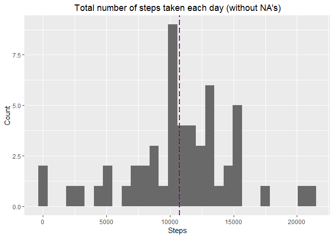

# Reproducible Research: Peer Assessment 1


## Loading and preprocessing the data


```r
# Unzip the "activity.zip" archive
# Load the data into R
# Although the task instructions say that all the data preprocessing should be done at this section I think it would be more understandably if I do it separately for each part of the assignment

unzip("activity.zip")
activity<-read.csv("activity.csv")
activity$date<-as.Date(activity$date)
```

Initial dataset - *activity* - includes **17568** rows and **3** columns (steps, date, interval). Among them there are NA values - the dataset includes **2304** intervals with undefined number of steps taken. 

## What is mean total number of steps taken per day?

**For this part of analysis we will ignore missing values in our dataset.**


```r
# At the first stage of the data transformation our dataset still contains NA's. But after applying 'aggregate' function we get rid of them ('na.action' argument of this function, which indicates what should happen when the data contain NA values is set by default to ignore missing values in the given dataset)

activity_1<-aggregate(steps ~ date, data=activity, sum)
```


```r
# Calculating mean and median of the total number of steps taken per day

head(activity_1)
```

```
##         date steps
## 1 2012-10-02   126
## 2 2012-10-03 11352
## 3 2012-10-04 12116
## 4 2012-10-05 13294
## 5 2012-10-06 15420
## 6 2012-10-07 11015
```

```r
mean(activity_1$steps)
```

```
## [1] 10766.19
```

```r
median(activity_1$steps)
```

```
## [1] 10765
```

So, the mean and median number of steps taken per day are very close. 


```r
# Instal 'ggplot2' package to make graphs and diagrams
# Installing 'ggplot2' package requires presence of 'plyr' package, which I will need later. That's why I will not install 'plyr' package separately later in my code

install.packages("ggplot2", repos="http://cran.rstudio.com/")
library(ggplot2)
```


```r
# Because mean (red dashed line) and median (blue dotted line) of total number of steps taken per day are so close (10765~10766.19) you can't see them clearly as separate lines on the graph 

ggplot(data=activity_1, aes(activity_1$steps))+ geom_histogram(fill = "dimgray") + ggtitle("Total number of steps taken each day (without NA's)") + xlab("Steps") + ylab("Count") + geom_vline(aes(xintercept=mean(activity_1$steps)), color="red", linetype="dashed", size=1)+ geom_vline(aes(xintercept=median(activity_1$steps)), color="blue", linetype="dotted", size=1)
```

```
## stat_bin: binwidth defaulted to range/30. Use 'binwidth = x' to adjust this.
```

 

## What is the average daily activity pattern?


```r
# Interval, which on average contains the maximum number of steps taken

activity_2<-aggregate(steps ~ interval, data=activity, mean)
head(activity_2)
```

```
##   interval     steps
## 1        0 1.7169811
## 2        5 0.3396226
## 3       10 0.1320755
## 4       15 0.1509434
## 5       20 0.0754717
## 6       25 2.0943396
```

```r
activity_2[which(activity_2$steps==max(activity_2$steps)), 1]
```

```
## [1] 835
```

So, the maximum number of steps are usually taken on **835** of the 5-minutes intervals and is equal to **206.1698113**.


```r
# Time series plot

ggplot(activity_2, aes(interval, steps)) + geom_line() + xlab("5 minutes interval") + ylab("Steps")
```

 


## Imputing missing values

**Now we will imput missing values in our estimates.**


```r
# Total number of missing values

sum(is.na(activity$steps))
```

```
## [1] 2304
```

```r
# Lets do some data mining
# How much days do we have in our dataset?

length(unique(activity$date))
```

```
## [1] 61
```

```r
# How much days with NA values do we have in our dataset?

not<-is.na(activity$steps)
activity_NA<-activity[not,]
activity_NA<-droplevels(activity_NA)
unique(activity_NA$date)
```

```
## [1] "2012-10-01" "2012-10-08" "2012-11-01" "2012-11-04" "2012-11-09"
## [6] "2012-11-10" "2012-11-14" "2012-11-30"
```

```r
length(unique(activity_NA$date))
```

```
## [1] 8
```

```r
# So, among 61 days only 8 of them have NA's

# The next step is to determine are there any days, which have no values at all
# Each day has 288 observations (24 hours * 12 five minutes intervals), so we need to check if there is any days there all of them are NA's

aggregate(interval ~ date, data=activity_NA, length)
```

```
##         date interval
## 1 2012-10-01      288
## 2 2012-10-08      288
## 3 2012-11-01      288
## 4 2012-11-04      288
## 5 2012-11-09      288
## 6 2012-11-10      288
## 7 2012-11-14      288
## 8 2012-11-30      288
```

```r
# So, there are no days in our dataset, that contain patrially filled data - it's either we have all observations for a particular day, or no values for that day at all (288*8=2304)
# It means that we cannot use strategy "use the mean/median for that day" for imputting missing values in our dataset. And the only option we have left with is to use "mean for that 5-minute interval". Likely we have already calculated means for all 5-minutes intervals earlier and now we only need to insert them into our data.

# Lets first create dataset that doesn't contain NA's

activity_3<-activity[!not, ]

# Now we have 3 datasets to work with: 1) activity_3 - contains only "good" observations; 2) activity_NA - contains only "bad" observations; 3) activity_2 - contains means for 5-minutes intervals averaged across all days

# First I want to remove unnessesary column 'steps' in 'activity_NA' dataset (all values there are NA's)

activity_NA<-activity_NA[, 2:3]

# Now lets join second and third datasets by 'interval' column

library(plyr)

activity_4<-join(activity_NA, activity_2, by = "interval")
activity_4<-activity_4[, c(3,1,2)] # rearranging the columns' order

# Now let's join 'activity_3' and 'activity_4' datasets

activity_5<-rbind(activity_3, activity_4)
activity_5<-activity_5[order(activity_5$date),]
rownames(activity_5)<-NULL # reset indexes in data frame

# "Make a histogram of the total number of steps taken each day..."

activity_6<-aggregate(steps ~ date, data=activity_5, sum)

ggplot(data=activity_6, aes(activity_6$steps))+ geom_histogram(fill = "dimgray") + ggtitle("Total number of steps taken each day (with NA's filled in)") + xlab("Steps") + ylab("Count") + geom_vline(aes(xintercept=mean(activity_6$steps)), color="red", linetype="dashed", size=1)+ geom_vline(aes(xintercept=median(activity_6$steps)), color="blue", linetype="dotted", size=1)
```

```
## stat_bin: binwidth defaulted to range/30. Use 'binwidth = x' to adjust this.
```

 

```r
# "...calculate and report the mean and median total number of steps taken per day"

head(activity_6)
```

```
##         date    steps
## 1 2012-10-01 10766.19
## 2 2012-10-02   126.00
## 3 2012-10-03 11352.00
## 4 2012-10-04 12116.00
## 5 2012-10-05 13294.00
## 6 2012-10-06 15420.00
```

```r
mean(activity_6$steps)
```

```
## [1] 10766.19
```

```r
median(activity_6$steps)
```

```
## [1] 10766.19
```

As we see, after imputting missing values we get slightly different estimate of the total number of steps taken per day median (it approached mean), but the mean remained the same.

## Are there differences in activity patterns between weekdays and weekends?


```r
# Lets create a new columon in our dataset indicating the day of the week and transforming it to show whether it's weekday or weekend

activity_5$weekdays<-as.factor(weekdays(activity_5$date))
levels(activity_5$weekdays)
```

```
## [1] "воскресенье" "вторник"     "понедельник" "пятница"     "среда"      
## [6] "суббота"     "четверг"
```

```r
recode<-list("weekday"=levels(activity_5$weekdays)[c(2,3,4,5,7)], "weekend"= levels(activity_5$weekdays)[c(1,6)]) 
levels(activity_5$weekdays)<-recode # replacing days of the week  by 'weekday', 'weekend' feature

# Lets separate the dataset into 2 - with weekdays and weekends

activity_wd<-activity_5[which(activity_5$weekdays=="weekday"),]
activity_we<-activity_5[which(activity_5$weekdays=="weekend"),]

activity_wd_t<-aggregate(steps ~ interval, data=activity_wd, mean)
activity_we_t<-aggregate(steps ~ interval, data=activity_we, mean)

# Lets compare the average number of steps taken on weekdays and weekends

sum(activity_wd_t$steps)
```

```
## [1] 10255.85
```

```r
sum(activity_we_t$steps)
```

```
## [1] 12201.52
```

```r
# So, as we could have expected average number of steps taken on weekends is greater than that on weekdays
```


```r
# Drawing separate graphs to compare daily activity patterns in weekdays and weekends

library(grid)

install.packages("gridExtra", repos="http://cran.rstudio.com/")
library(gridExtra)

WD<-ggplot(activity_wd_t, aes(interval, steps)) + geom_line() + ggtitle("weekdays") + xlab("5 minutes interval") + ylab("Steps")
WE<-ggplot(activity_we_t, aes(interval, steps)) + geom_line() + ggtitle("weekends") + xlab("5 minutes interval") + ylab("Steps")
grid.arrange(WD, WE, nrow=2)
```

 

